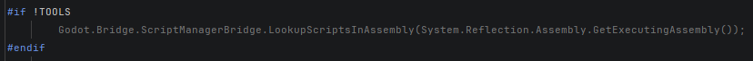
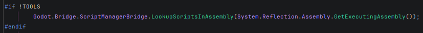
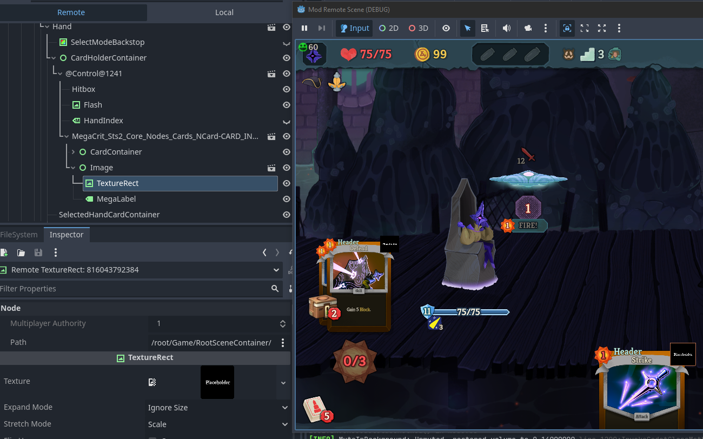
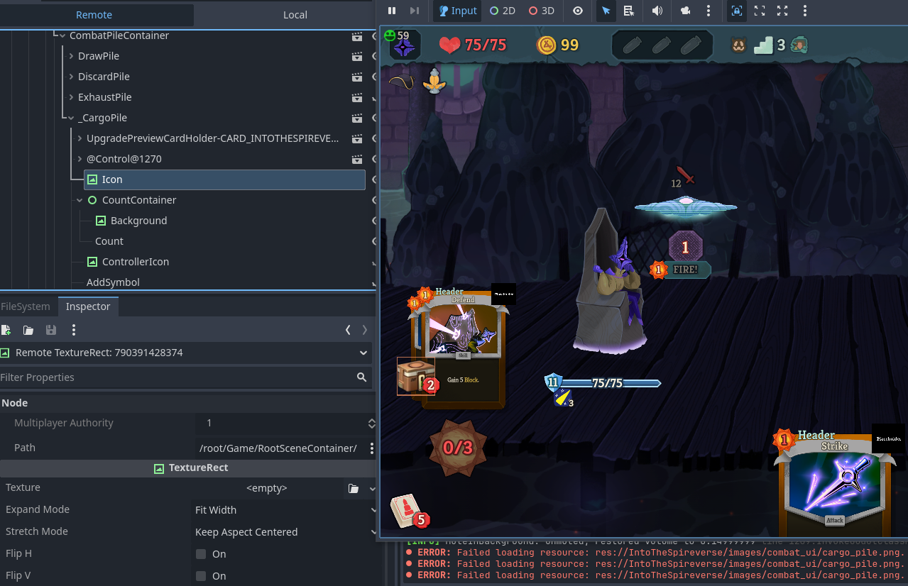
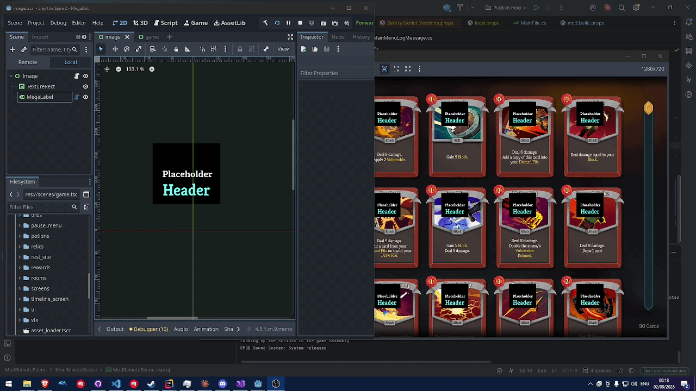

## Example Project for running your Slay the Spire 2 Mod via the Godot Editor-Player

Running your mod in the Editor-Player can help visualize and understand the relation of your Scenes, as well as those of Nodes you added to base game scenes.

Unfortunately the example project does not run out of the box, as it requires direct access to the games files which I won't upload.

*This is build upon [Lamali](https://github.com/lamali292)'s Symlink setup (see [Downfall](https://github.com/lamali292/Downfall) as an example)*

Side effects of this include:
 - Working addons (e.g. Being able to choose MegaLabels in the add node screen and seeing their properties in the Inspector)
 - Working Tools (e.g. The background asset picker for Act backgrounds to visualize them in the editor)

---

#### Table of content

- [Getting this Project to run](#getting-this-project-to-run)
- [Setting up your own Project](#setting-up-your-own-project)
- [Important](#Important)
- [Issues](#Issues)
- [Examples](#Examples)

---

### Getting this Project to run

To run this example project you need to do the following:
1. Use [GDRE Tools](https://github.com/GDRETools/gdsdecomp/releases) to extract the games assets.
2. Rename `local.props.example` to `local.props` and fill out the paths.
3. Run `build\link-assets.ps1` to symlink the decompiles folders.
4. Manually copy the compiler generated classes (`--**.cs`) into your root.
5. Copy `default_bus_layout.tres` into your root.
6. This example depends on BaseLib. Open your Godot installation and next to the exe add a new `mods` directory. Copy the BaseLib mod into it.
7. Publish once so Godot generates the .godot folder. (The first time will take quite long)
8. Copy all `spatlas` and `spskel` files from the decomps `.godot\imported\` folder into yours.

You should now be able to open the godot editor and run the game. 

For debugging with the editor, make sure in the godot editor `Debug->Keep Debug Server Open` is checked.  
Add a new Configuration:  
Set the Godot executable as the `Exe path` (not the games exe!)  
Copy `--path "./" --remote-debug tcp://127.0.0.1:6007` into the `Program arguments`
Set the working directory as this mods root `..\ModRemoteScene`

Open the Godot editor and then press the Debug Icon next to the Configuration in Rider. You should now be able to get both, breakpoints; and the remote scene view inside the Godot Editor.

The Godot Editor will now also show the logs inside of it.  
Please note that as long as the editor is open: Due to the above set Debug setting, publishing will fill the logs with the publish logs. This includes the games log output `godot.log` file.

---

### Setting up your own Project

Setting up your own project is very similar:

1. Use [GDRE Tools](https://github.com/GDRETools/gdsdecomp/releases) to extract the games assets.
2. Copy both the `build` and `editor` folders into your project.  
    I recommend reading through all the files. (even if you just skim over them)
3. In your mods `csproj` import `mod.build.props` and `mod.build.targets`. At the bottom of it, copy the Sentry addon logic from the example mod.  
   Besides the Sentry fuckery, the example project only has a single `PropertryGroup`and `ItemGroup` in it.
4. Replace your `project.godot` file with the one from the example or the decomp.  
   If you copied the file from the example, change the following:  
   1. Under `[application]` change `config/name` to your mod name.
   2. Under `[dotnet]` change the `project/assembly_name` to your mods.  
   
   If you instead copied the file from the decomp, also change this:
   1. Add this at the top of `[autoload]`: `RuntimeBootstrap="*res://editor/GameRegistrationBootstrap/RuntimeBootstrap.cs"`
   2. Under `[dotnet]` remove `project/solution_directory`.
   3. Under `[editor_plugins]` edit `enabled` by adding `"res://editor/GameRegistrationBootstrap/plugin.cfg" as the **first** entry.
   4. Under `[Sentry]` remove `config/dsn` and set `config/disable_in_editor` to `true`

5. Create a `local.prop` file in your root and fill it in similar to the example file.
6. Follow from step 3 above.

#### Make sure your gitignore is properly configured (or whichever vcs you use)

---

## Important

There are three configurations: `Debug`, `ExportDebug` and `ExportRelease`

The Editor uses the `Debug` configuration. The example project (through the `mod.build.targets` file) is set up so that a build in `Debug` does NOT copy the file into the games mods directory. This is because it includes the editor folder. Instead, use one of the other configurations if you want to export to the actual game.

`MainFile.cs` makes use of the `TOOLS` preprocessor directive to prevent errors/warning that would otherwhise happen if the editor tries to load the scripts again. Changing between configurations will include/exclude it.

`Debug`

`ExportDebug` | `ExportRelease`

---

## Issues

This solution is not perfect. Notable issues:
 - It always loads from the same mod directory. So if you use this with multiple projects you either have to accept that it loads all of them or add/remove mods from the directory. (Or install multiple godot installations since the directory is relative to the godot exe)
 - You can load other mods in the editor (important for dependencies) and see their nodes in the remote tree. However, clicking on any of them will likely spam the console with resource not found errors. They are harmless but annoying. 
   The Editor and Editor-Player awareness of resources are different. And the godot engine directly prohibits mounting pck files in the editor.  
   If you must see these files, you could extract them from the mod via GDRE and temporarely add them into your project. (Untested but should work)  
   You can click on all Nodes from your mod or the base game.
 - MegaLabels have a safeguard that throws an error if no `font` (`normal_font` for MegaRichTextLabel) is set. The explanation for why is inside the addons code in the decomp. This is also harmless.
 - The game makes a few different decisions based on if it runs in the editor-player or not. They don't matter as long as your mod doesn't depend on them. (see `editor/IsEditorPatches` for an important BaseLib example)

---

### Examples

Looking at the card node in the hand with the AddedNode from the example mod.  
*Note how we can see the Texture because its reference is local*

Loading the mod [Into the Spireverse](https://steamcommunity.com/sharedfiles/filedetails/?id=3747503080) and looking at the cargo pile in the remote tree.  
*Note how we can't see the Texture because there is no local reference.* 
*This also spams the afformentioned errors because this is the example project and not the SpireVerse project*

Using the editor-player to visualize the relation of a node added to the card.tscn, and modifying the scene during play to see the changes live.  
*This does confuse the editor-player. I highly recommend that after modifying the scene, you save and reload the project to avoid any inconsistencies.*

